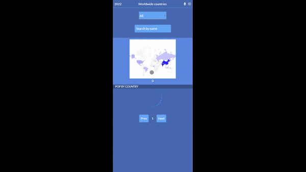
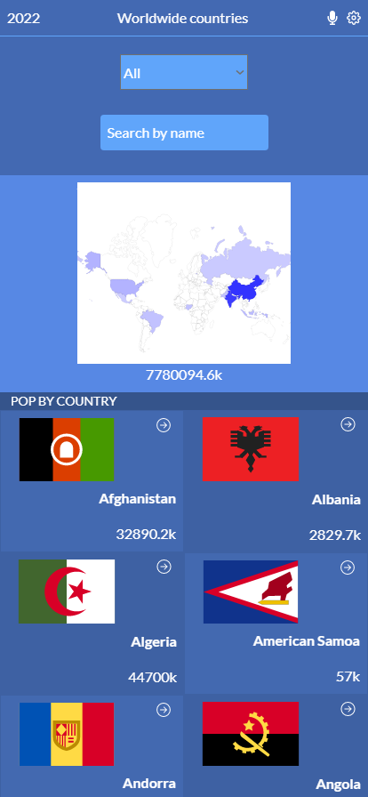
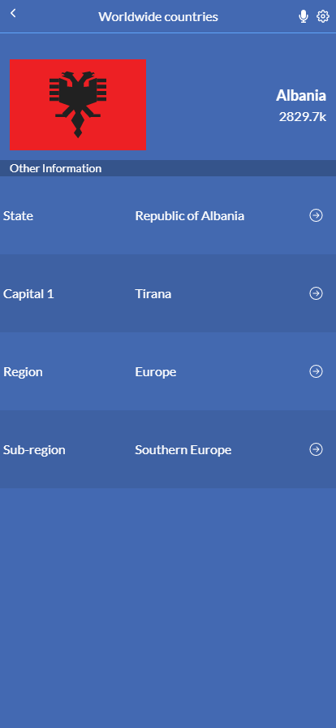

# countries-worldwide
> An App that displays a list of countries, including information about their population and cities. Built using React, Redux, Tailwind CSS, Jest, and the Countries API,

## Screenshots






## Live Version
[Go Live](https://festive-shirley-0ca9cb.netlify.app/)

## Built With
- React
- Redux
- Tailwind CSS
- Jest for testing
- Tools used - Git(version control), WebHint(linting tool), Stylelint(style linting), ESLint(Javascript linting)

## Prerequisites
 - [React](https://reactjs.org/docs/getting-started.html)
 - [Redux](https://redux.js.org/tutorials/quick-start)
 - [Git](https://git-scm.com/downloads)
 - [Node](https://nodejs.org/en/download/)

## Sample code

```
if (queryRegion !== 'all') {
    countries = countries.filter((country) => {
      const countryRegion = country.un_geoscheme.region;
      return countryRegion === queryRegion;
    });
    countriesLength = countries.length;
  }

  const regionPop = countries.reduce(
    (partialSum, country) => partialSum + parseInt(country.population.total, 10), 0,
  );

  if (queryName.trim()) {
    countries = countries.filter((country) => {
      const name = country.name.toUpperCase();
      return name.includes(queryName.trim().toUpperCase());
    });
    countriesLength = countries.length;
  }

  const changePageNumber = (value) => {
    if (value < 0 && pageNumber === 1) return;
    if (value > 0 && pageNumber * 6 > countriesLength) {
      return;
    }
    setPageNumber((prev) => prev + value);
  };

```

```
 { Math.abs(population) > 999 ? `${((Math.abs(population) / 1000).toFixed(1))}k` : Math.abs(population)}
```


## Installation

Go to your terminal, navigate to your working directory and run

`git clone https://github.com/RayhanTabase/countries-worldwide.git`

After that navigate to the newly created folder

`cd countries-worldwide`

You now have access to the files.
To install necessary dependencies run

`npm install`

Start a local server running the command

`npm start`

You should now have the project running locally on a dev server.

## Author

👤 **Salim Abdulai**

- GitHub: [@RayhanTabase](https://github.com/RayhanTabase)
- Twitter: [@RayhanTabase](https://twitter.com/@RayhanTabase)
- LinkedIn: [Salim-Abdulai](https://linkedin.com/in/salimabdulai)
- Email: salimabdulai2@yahoo.com

## Acknowledgments
Original design idea by Nelson Sakwa on [Behance](https://www.behance.net/gallery/31579789/Ballhead-App-(Free-PSDs)).

## 🤝 Contributing

Contributions, issues, and feature requests are welcome!

Feel free to check the [issues page](../../issues/).

## Show your support

Give a ⭐️ if you like this project!

## 📝 License

This project is [MIT](./MIT.md) licensed.
